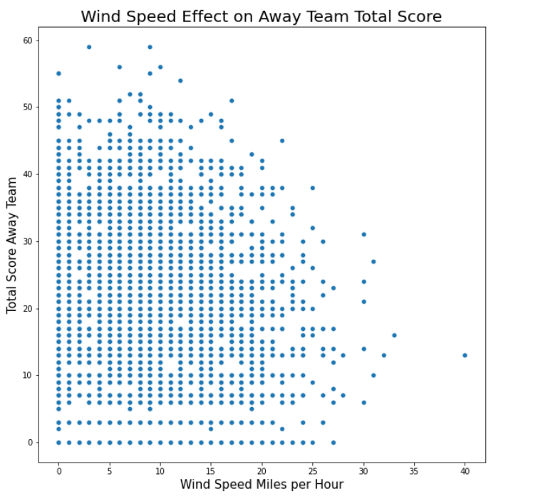

# Understanding the various factors that affect the outcomes of the game and betting lines for the NFL
#### Anthony Gravink
### Business Problem
Help sportsbooks and sports bettors understand various factors that influence the total score of a game with it's betting significance
## Data
https://www.kaggle.com/datasets/tobycrabtree/nfl-scores-and-betting-data?resource=download
13233 Observations
## Methods
- Imputed values based on median for the weather columns because there were outliers form various storms or heatwaves that greatly affected the data.
- Imputed values based on frequency for the over/under line because not many values were empty, and most NFL score totals are around 45
- Dropped schedule date column because each value was unique and important data such as year and regular season week were contained in other columns
- Performed various machine learning models to find how much variance could be explained on the test data 
## Visualizations

> Away team scoring slightly begins to decrease when wind speed passes 15 miles per hour. While not super drastic, it can't be overlooked when examaning a low scoring game.

## Results
- Away team score had a higher impact on who was favorite and the spread than the home team
- Wind speed has a small negative correlation with total score. Perhaps the influence of weather on the game is why home team has a lesser impact on the spread than away teams.
- NFL scoring has increased over the years, with away teams contributing to this scoring increase more than home teams. Offensive style and better quarterbacks have possibly made it easier for teams to be more consistent scoring on the road 
## Limitations/Recommendations
- One limitation is the dataset didn't contain any data on the teams playing in that game, such as record, points scored per game, points allowed per game, and others that would help explain more about the scoring outcome
- Include a column specifically denoting whether the line was over or under and whether the soread favorite covered or not. Looking at the data one can figure that out, but having seperate columns would help with analysis
